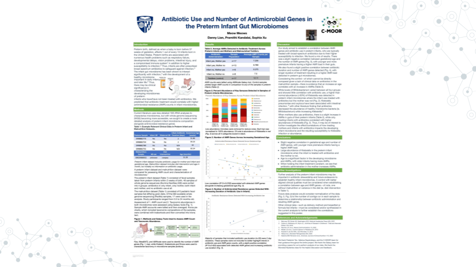
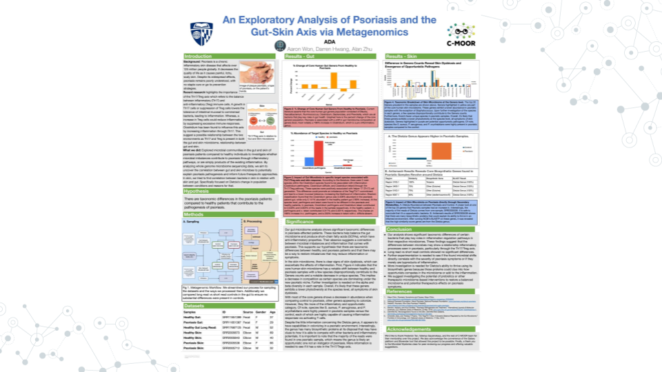
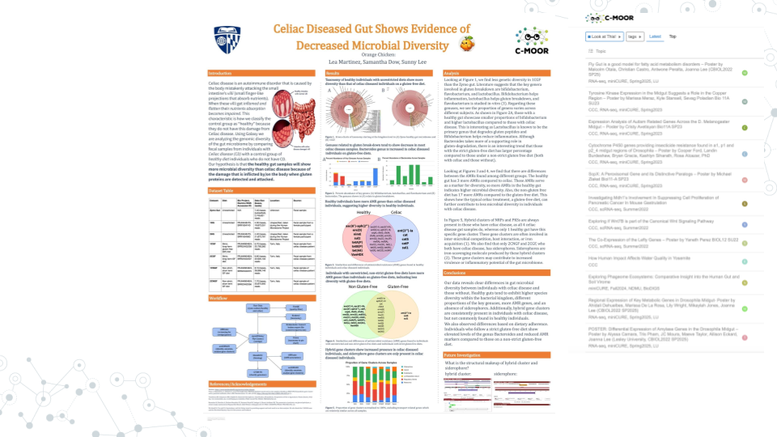
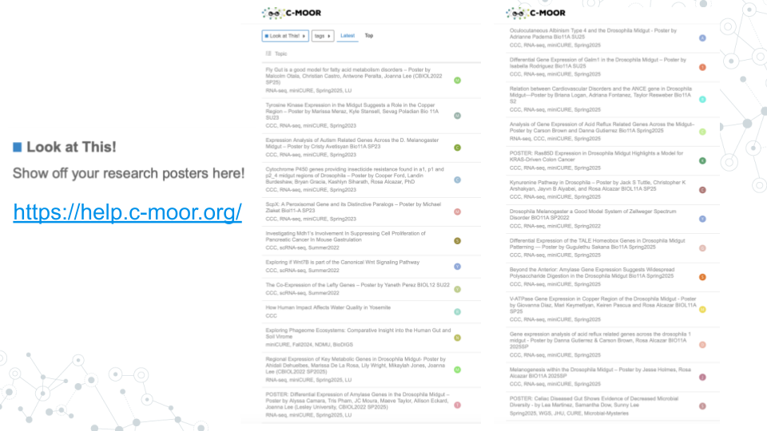
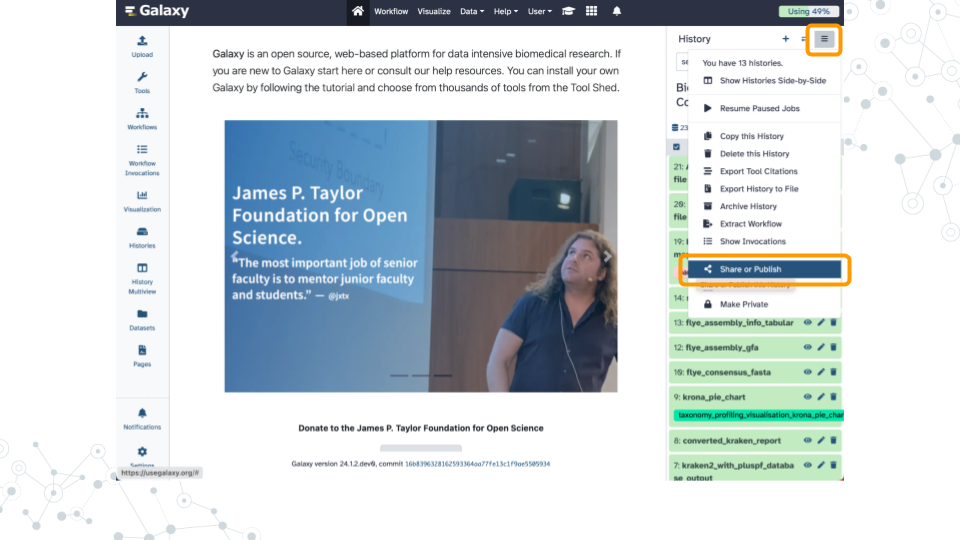

# (PART\*) APPENDIX {-}

# Example CURE and miniCURE Projects

<h2>Look at This!</h2>

Explore other miniCURE and CURE projects in our [Look at This!](https://help.c-moor.org/c/look-at-this/8) category

<h2>Microbial Mysteries CURE, JHU 2025</h2>

- [Antibiotic Use and Number of Antimicrobial Resistance Genes in the Preterm Infant Microbiomes](https://help.c-moor.org/t/poster-antibiotic-use-and-number-of-antimicrobial-resistance-genes-in-the-preterm-infant-microbiomes/506)

- [An Exploratory Analysis of Psoriasis and the Gut-Skin Axis via Metagenomics](https://help.c-moor.org/t/poster-an-exploratory-analysis-of-psoriasis-and-the-gut-skin-axis-via-metagenomics/507)

- [Celiac Diseased Gut Shows Evidence of Decreased Microbial Diversity](https://help.c-moor.org/t/poster-celiac-diseased-gut-shows-evidence-of-decreased-microbial-diversity-by-lea-martinez-samantha-dow-sunny-lee/509)

<h2>And many more!</h2>

# Troubleshooting

Science is hard, and getting computers to do what you want sometimes feels impossible.
While we can't address every problem, below are some suggestions that may help you move forward.
If you need more help, perhaps you might give an [Online Community] a chance?

### Share Galaxy History {-}

Many times people are more able and willing to help troubleshoot a problem when provided a [minimal, reproducible example](https://stackoverflow.com/help/minimal-reproducible-example){target="_blank"}.
One great feature of Galaxy is the ability to share your exact history through a custom URL.
See how to do this in Step 1 "Share via link" in the FAQ [Sharing your History](https://training.galaxyproject.org/training-material/faqs/galaxy/histories_sharing.html){target="_blank"} 

### Galaxy Fundamentals {-}

Galaxy has many advanced features to help you scale an analysis from a single dataset to production level settings.
Learning more about these features can give you insight into what is going on under the hood and may help when troubleshooting problems.

- Lost among your histories? -- [Understanding Galaxy history system](https://training.galaxyproject.org/training-material/topics/galaxy-interface/tutorials/history/tutorial.html){target="_blank"}

- Datatset or cellection? -- [Using dataset collections](https://training.galaxyproject.org/training-material/topics/galaxy-interface/tutorials/collections/tutorial.html){target="_blank"}

- Trouble with workflows? -- [Creating, Editing and Importing Galaxy Workflows](https://training.galaxyproject.org/training-material/topics/galaxy-interface/tutorials/workflow-editor/tutorial.html){target="_blank"}

- More on how to create a workflow? -- [Annotate, prepare tests and publish Galaxy workflows in workflow registries](https://training.galaxyproject.org/training-material/topics/galaxy-interface/tutorials/workflow-fairification/tutorial.html)

- Out of storage space? -- [Downloading and Deleting Data in Galaxy](https://training.galaxyproject.org/training-material/topics/galaxy-interface/tutorials/download-delete-data/tutorial.html){target="_blank"}
