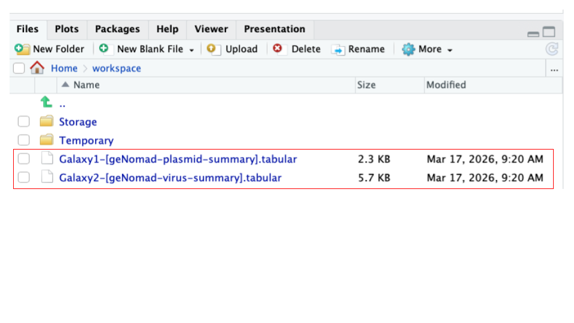
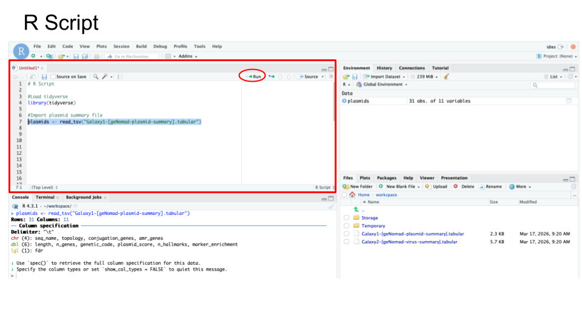

## Activity: RStudio

### Purpose

The purpose of this activity is to introduce the RStudio environment on SciServer for importing, exploring, filtering, and visualizing genomic data. 
Students will gain hands-on experience working with real bioinformatics output files (geNomad plasmid and virus summaries) and get a taste or foundational data analysis skills using R.

### Learning Objectives

By the end of this activity, students will be able to:

1. Data import and environment setup
    - Load tabular data files into R/RStudio using functions such as read_tsv()
    - Navigate and use the RStudio interface, including file upload and script execution
1. Data exploration and manipulation
    - Explore datasets using basic R commands (e.g., viewing objects, inspecting column names)
    - Sort and filter data using base R and tidyverse functions (e.g., sort(), filter(), %>%)
    - Identify and subset biologically relevant data (e.g., contigs with AMR genes, non-provirus viral contigs)
1. Data visualization and reproducibility
    - Create and customize basic data visualizations using histogram plots in R (e.g., modifying titles and colors)
    - Write, annotate, and organize reproducible R scripts for data analysis workflows

### Activity 1 – Import files to RStudio on SciServer

*Estimated time: 10 min*

#### Instructions

1. Download files.
    - Download two geNomad output files from Galaxy history below - plasmid summary and virus summary. 
    - The files correspond to geNomad output for Zymo gut standard D6331 subset:
      - <https://usegalaxy.org/u/valerie-g/h/genomad-plasmid-virus-summary-zymo-gut-standard-d6331-subset>
2. Launch RStudio on SciServer.
    a. Log into <https://sciserver.org>.
    a. Navigate to SciServer ‘Compute’ (one of the cards on the bottom of the page).
    a. Click “Create container”.
    a. Give your container a name (eg. RStudio)
    a. In the “Compute Image” drop-down menu, select `Bioconductor 3.17 (RStudio)`
    a. Hit the green ‘Create’ button on the bottom.
    a. Click on the ‘RStudio’ Name to open RStudio window.
3. Upload files to RStudio on SciServer.
    a. Navigate to the `Files` pane located in the lower-right panel of the RStudio.
    a. Click the **'Upload'** button in the toolbar of the Files pane.
    a. Click **'Choose File'** to upload the two geNomad output files (you previously downloaded in Step 1 - uploading one at a time.
    a. You should now see two downloaded files in your ‘Files’ pane.



4. Load files into R/RStudio.
    a. Create a new file to store your R code by opening the File menu, selecting New File, and then R Script
    a. Enter the following two R commands into the new top left window of RStudio
        a. Load the R package called ‘tidyverse’ by entering the command **library()**.
        a. Import a file of interest by using the function **read_tsv()**.
            - See code block below to load the file “Galaxy1-[geNomad-plasmid-summary].tabular” and store it as a new object (variable) called e.g. ‘plasmids’.

        ```
        library(tidyverse)
        plasmids <- read_tsv("Galaxy1-[geNomad-plasmid-summary].tabular")
        ```

    a. Highlight **both** commands and then click **‘Run’**.

#### Questions

|1. Provide the command you used to import your **geNomad-plasmid-summary** file:|
| :--------- | 
| <br>       |

|2. Provide command you used to import your **geNomad-virus-summary** file:|
| :--------- | 
| <br>       |

### Activity 2 – Explore files in RStudio on SciServer

*Estimated time: 10 min*

#### Instructions

1. Use basic R commands to explore imported files in RStudio.
1. Craft your commands using an R Script - **you will be asked to provide your R Script code**.
    - Include all commands you used
    - Annotate all commands you used
    - See sample R Code below:



Your R Script for Activity 2 should include:

    # Part 1: Plasmids
    
    ### Explore object
    <your commands>
    ### Explore column names
    <your commands>
    ### Sort file based on plasmid length, from high to low
    <your commands>
    ### Filter file to only include contigs with detected AMRs (amr_genes)
    <your commands>
    
    
    # Part 2: Virus
    
    ### Explore object
    <your commands>
    ### Explore column names
    <your commands>
    ### Sort file based on virus length, from high to low
    <your commands>
    ### Filter file to exclude Provirus
    <your commands>

#### Questions

#### Part 1 - Explore geNomad plasmid summary file in RStudio

1. View your imported plasmid file by typing in the name of your object - **plasmids**.

    ```
    plasmids
    ```

|Question: How many plasmid contigs (rows) are in your file?|
| :--------- | 
| <br>       |

2. View column names using function **colnames()**.

    ```
    colnames(plasmids)
    ```

|Question: Copy and paste column names below.|
| :--------- | 
| <br>       |

3. Sort plasmid contigs based on decreasing length, using function **sort()**.
    - Store as a new object called **“sorted”**; 
    - After sorting, to view the ‘sorted’ object, type ‘sorted’.
        - Note: the **sort()** command is a function from the **base R package**. It is available in R without installing any special libraries.
    - Your command will contain the following components:
        - `sorted <-` -- assigns the result of the operation to a new variable
        - `sort()` -- the function used to do the sorting
        - `plasmid$length` -- points to the “length” column in the plasmids object
        - `decreasing = TRUE` -- specifies that sorting should be descending rather than the default ascending.

Use these commands:

    sorted <- sort( plasmids$length, decreasing = TRUE )
    sorted

|Question: What is the length of the largest contig length in a file? This should be the 1st number?|
| :--------- | 
| <br>       |

4. Filter plasmid contigs using the **filter()** function to retain only those that contain antimicrobial resistance (AMR) genes (amr_genes column); For this, you will need to remove the missing values (NA). Once filtered, view the filtered contigs by calling on the ‘filtered’ object.
    - **Store as a new object called “filtered”**; 
    - After filtering, to view the ‘filtered’ object, type **‘filtered’**.
        - Note: We use the `dplyr` **filter()** function and the **%>%** pipe operator in the example below, which are both part of the **tidyverse ecosystem of package** - a popular extension in R, and is not a base R function. 
            - So, you can mix and match functions from different packages!
    - Your command includes the following operations:
        - `%>%` -- is an operator that sends the output data from one command as the input data into the next command
        - `filter()` --  this function selects rows based on a condition
        - `!=` --  is the “Not equal to” operator

Use these commands:

    filtered <- plasmids %>% filter (amr_genes != "NA")
    filtered

|Question: How many plasmid contigs had an AMR gene?|
| :--------- | 
| <br>       |

#### Part 2 - Explore geNomad virus summary file in RStudio 

- Use commands you learned in Part 1 above, as a guide to explore virus summary file.

1. View your imported virus file by typing in the name of your object.

|1A: Type your command below.|
| :--------- | 
| <br>       |

|1B: How many virus contigs (rows) are in your file?|
| :--------- | 
| <br>       |

2. View column names using function colnames().

|2A: Type your command below.|
| :--------- | 
| <br>       |

|2B: Copy and paste column names below.|
| :--------- | 
| <br>       |

3. Sort virus contigs based on decreasing length, using function **sort()**. Provide your commands and answer the question below.
    - Store as a new object called **“sortedV”**; 
    - After sorting, to view the ‘sorted’ object, type **‘sortedV’**.

|3A: Type your commands below:|
| :--------- | 
| Command 1:|
| Command 2: |

|3B: What is the largest contig length in the file?|
| :--------- | 
| <br>       |

4. Filter viral contigs using **filter()** function to all viral contigs EXCEPT those identified as “Provirus” (topology column); For this, you will need to eliminate the “Provirus”. 
    - Store as a new object called **“filteredV”**; 
    - After filtering, to view the ‘filtered’ object, type **‘filteredV’**.

|4A: Type your commands below:|
| :--------- | 
| Command 1:|
| Command 2: |


|4B: How many viral contigs were NOT classified as Provirus?|
| :--------- | 
| <br>       |

### Activity 3 – Plot and modify histogram of contig lengths

*Estimated time: 10 min*

#### Instructions

1. Use base R commands to plot and modify histogram in RStudio
2. Continue to add this code to your R Script. 

#### Questions

#### Part 1 - Plot histogram of plasmid lengths

1. Plot histogram of plasmid contig lengths using function **hist()** and specifying the length column.
    - Your histogram will appear in the Plots tab (bottom right)

Use this command: 

    hist(plasmids$length)

|1A: Paste resulting plot below. |
| :--------- | 
| <br>       |

2. Modify your histogram by changing the title to “Plasmid Length Distribution” 
Use this command: 

    hist (plasmids$length, main = "Plasmid Length Distribution")

|2A: Paste resulting plot below. |
| :--------- | 
| <br>       |

3. Modify your histogram by changing histogram color to lightblue.

Use this command: 

    hist ( plasmids$length, main = "Plasmid Length Distribution", col = "lightblue" )

|3A: Paste resulting plot below. |
| :--------- | 
| <br>       |

#### Part 2 - Plot histogram of virus lengths

1. Plot histogram of viral contig lengths using function hist() and specifying the length column
    - Your histogram will appear in the Plots tab (bottom right)

|1A: Type your command below: |
| :--------- | 
| <br>       |

|1B: Paste resulting plot below. |
| :--------- | 
| <br>       |

2. Modify your histogram by changing the title to “Virus Length Distribution” 

|2A: Type your command below: |
| :--------- | 
| <br>       |

|2B: Paste resulting plot below. |
| :--------- | 
| <br>       |

3. Modify your histogram by changing histogram color to 'lightgreen'.

|3A: Type your command below: |
| :--------- | 
| <br>       |

|3B: Paste resulting plot below. |
| :--------- | 
| <br>       |

#### Part 3 - Copy and paste your R Script below, which should be structured as follows:

    # Import files into R Studio
    
    ### Plasmids
    <your commands>
    ### Virus
    <your commands>
    
    # Explore imported files
    
    ### Plasmids
    <your commands>
    ### Virus
    <your commands>
    
    # Plot histogram of lengths
    
    ### Plasmids
    <your commands>
    ### Virus
    <your commands>

| Paste your R Script below. |
| :--------- | 
|            |
|            |
|            |
|            |
|            |
|            |
| <br>       |

### Grading Criteria

- Download as Microsoft Word (.docx) and upload on Canvas

### Footnotes

**Resources**

- [Google Doc](https://docs.google.com/document/d/12jH1dkfMfDc3W54VEt94k_6Tvq3_WOej)

**Contributions and Affiliations**

- Valeriya Gaysinskaya, Johns Hopkins University
- Frederick Tan, Johns Hopkins University

Last Revised: March 2026
