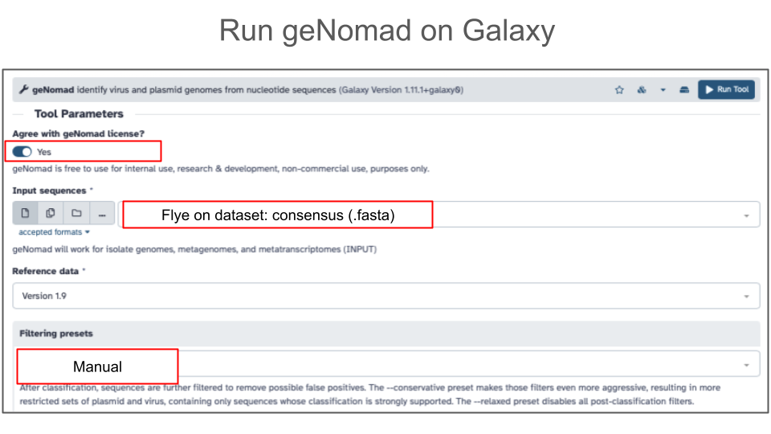
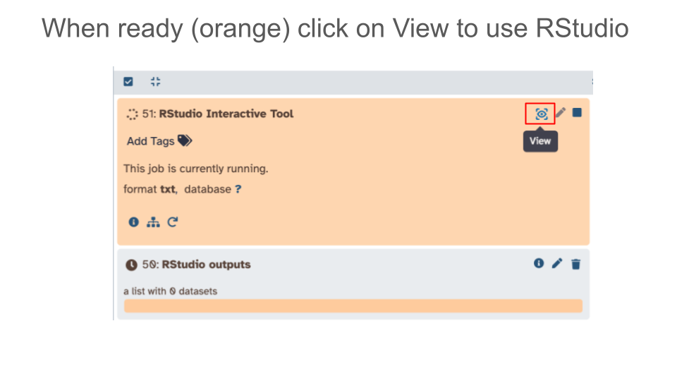
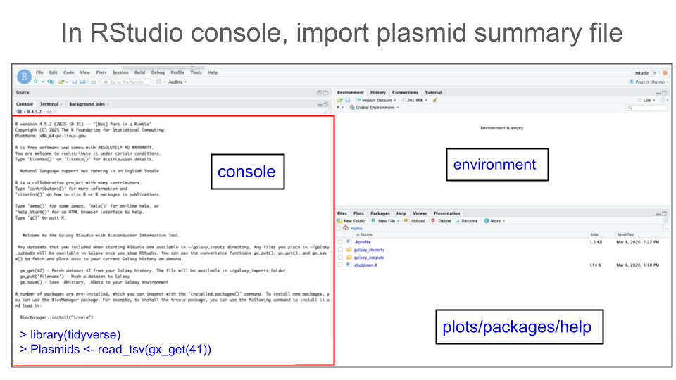
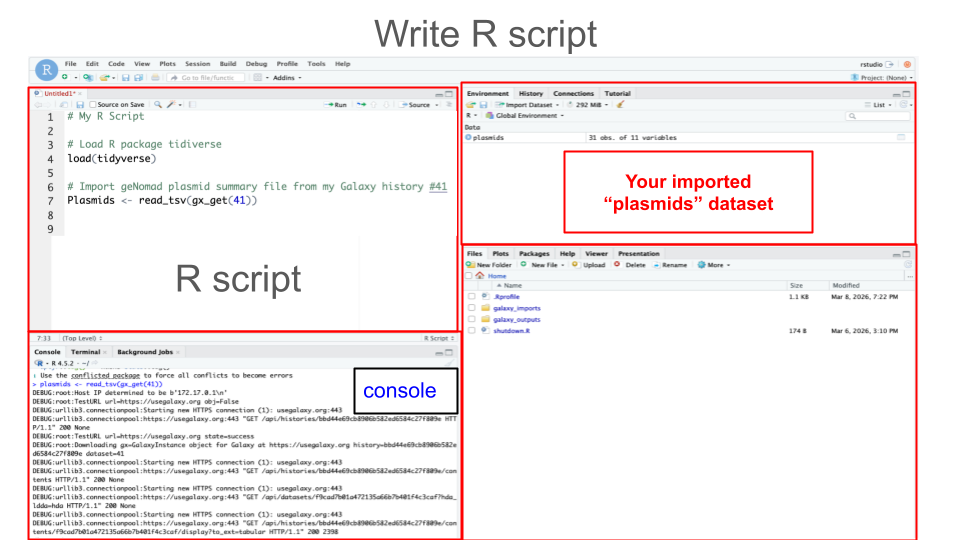
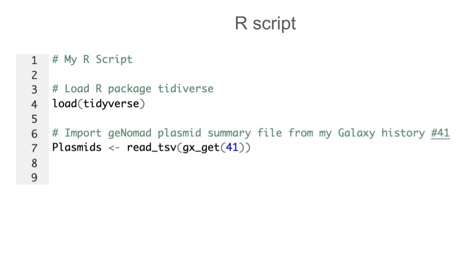

## Activity: geNomad

### Purpose

The goal of this activity is to identify plasmid and virus sequences with [geNomad](https://pubmed.gov/37735266). 
geNomad is a modern classification tool that uses a dataset of over 200,000 gene markers specific to chromosomes, plasmids, or viruses to quickly find plasmids and viruses in metagenomic sequences. 
Additionally, geNomad uses a deep neural network approach that is gene-independent and reference alignment-independent to classify sequences as plasmids of viruses. 
Starting with **contigs** as your input, geNomad can:

- Identify sequences of plasmids and viruses 
- Functionally annotate plasmid and viral genes
- Taxonomically classify viral sequences

### Learning Objectives

1. Run the geNomad tool in Galaxy
1. Examine geNomad output (plasmids and virus)
1. Plot geNomad output (plasmid length and number of genes) in RStudio on Galaxy

### Activity 1 – Run geNomad

*Estimated time: 10 min*

#### Instructions

1. Import the dataset corresponding to assembled contigs from PacBio-sequenced Zymo gut standard D6331 - a 3.4 Gb data subset assembled with Flye tool.
    - <https://usegalaxy.org/u/valerie-g/h/flye-assembly-zymo-gut-standard-d6331-subset>
1. Go to Tools and find geNomad
    a. Agree with geNomad license
    a. Use assembled contigs (from Flye assembly) as input
    a. Under **filtering presets**, select **Manual settings** which correspond to the default geNomad settings
    a. Click **Run Tool**



#### Questions

|1. Provide your Galaxy history with geNomad output:|
| :--------- | 
| <br>       |

|2. Based on geNomad output file names, what information does geNomad provide?|
| :--------- | 
| <br>       |

### Activity 2 – Explore geNomad output in Galaxy

*Estimated time: 10 min*

#### Instructions

1. Import two of eight geNomad output files for Zymo gut standard D6331 (Activity 1 output): 
    - <https://usegalaxy.org/u/valerie-g/h/genomad-plasmid-virus-summary-zymo-gut-standard-d6331-subset>
1. View geNomad output files to explore.

#### Questions

1. Click on geNomad-plasmid-summary file and answer the questions below:

|A. How many contigs were classified as plasmid-derived contigs?|
| :--------- | 
| <br>       |

|B. Does every plasmid contig have a conjugation gene?|
| :--------- | 
| <br>       |

|C. Does every plasmid contig have an amr_gene (anti-microbial resistance gene)?|
| :--------- | 
| <br>       |

2. Click on geNomad-virus-summary file and answer the questions below:

|A. How many contigs were classified as virus-derived contigs?|
| :--------- | 
| <br>       |

|B. Google search full taxonomy of the first viral contig in the file and record below 1 thing you learned about this virus.|
| :--------- | 
| <br>       |

|C. What is the most common genomic context (topology) in which virus was identified in this data subset?|
| :--------- | 
| <br>       |

### Activity 3 – Examine geNomad plasmids in RStudio

*Estimated time: 15 min*

#### Instructions

1. Launch RStudio tool in Galaxy
    - Click on “Interactive Tools” in the left hand Activity Bar and launch RStudio
    - You don’t need to include input datasets with your RStudio launch - we will import data once RStudio is launched.



2. Import data into RStudio
    a. In your Galaxy history, identify which Galaxy history number (dataset) corresponds to the plasmid summary output file. 
        -  Let's assume dataset 41 in your Galaxy history is a plasmid summary file from geNomad and you want to read it into your RStudio.
    a. In your **RStudio Console**, use the function `gx_get()` to import (copy) a dataset of interest from Galaxy history to your RStudio session.
    
        ```
        # Get Galaxy history dataset #41
        gx_get(41)
        ```
        
    a. In addition, you have to use a proper R function to read the file. To read tabular files formatted as tab-separated values (tsv), use function `read_tsv()`. To do so, you will first need to load an R package called `tidyverse`. Use the following pieces of code:
    
        ```
        # Load tidyverse
        library(tidyverse)
        
        # Read a .tsv file
        read_tsv(gx_get(41))
        ```
        
    a. Now that you have all pieces of code, save your tsv file as an object called, e.g. `plasmids` (or give it another convenient name of your choice).
    
        ```
        # Final import command
        plasmids <- read_tsv(gx_get(41))
        ```
        
    a. Once code is ready, type the 2 commands (to load tidyverse, and to import plasmid_summary tabular file) into your RStudio console



3. Create an R script of the commands from Step 2: 
    - Just like the best practice for wet-lab experiments is keeping a lab notebook, the best practice for computational experiments is keeping a notebook with all your code (commands) - e.g. having a record of your R script.
    - For best practice, you should annotate each block of code





#### Questions

#### Part 1 - Explore data in RStudio

1. Preview first rows of a file using function `head()`.

|Command: head(plasmids)|
| :--------- | 
|  Question:  Copy and paste output of command below: |
|  Answer:            |

2. View column names using function `colnames()`.

|Command: colnames(plasmids)|
| :--------- | 
|  Question:  Copy and paste output of command below: |
|  Answer:            |

3. Summarize each variable using funciton `summary()`.

|Command: summary(plasmids)|
| :--------- | 
|  Question:  Copy and paste output of command below: |
|  Answer:            |

4. Check the number of rows and columns - dimensions - of the file using function `dim()`.

|Command: dim(plasmids)|
| :--------- | 
|  Question:  Copy and paste output of command below: |
|  Answer:            |

#### Part 2 - Plot histogram of plasmid lengths

1. Plot histogram of plasmid lengths using function `hist()`.
    - Note, a dollar sign ($) in the command below indicates column

|Command: hist(plasmids$length)|
| :--------- | 
|  Question:  Copy and paste output of command below: |
|  Answer:            |

#### Part 3 - Plot histogram of plasmid gene density

1. Plot histogram of plasmid gene density (`n_genes`) using function `hist()`.
    - Note, a dollar sign ($) in the command below indicates column

|A. Type your command below:|
| :--------- | 
| <br>       |

|B. Paste your output histogram below::|
| :--------- | 
| <br>       |

### Grading Criteria

- Download as Microsoft Word (.docx) and upload on Canvas

### Footnotes

**Resources**

- [Google Doc](https://docs.google.com/document/d/1cVR34TtQGApsOQnTSRzpQMm83TWBqtKD)

**Contributions and Affiliations**

- Valeriya Gaysinskaya, Johns Hopkins University
- Frederick Tan, Johns Hopkins University

Last Revised: March 2026
