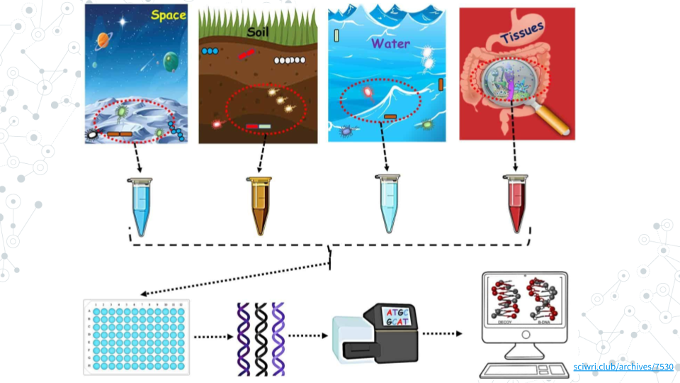

# About {-}

Welcome to Microbial Mysteries, a Course-based Undergraduate Research Experience (CURE) that takes you on a genomics adventure from soil to gut!

This CURE allows students to develop a project using genomics datasets from environments such as human gut and soil, and learn how organisms, high-throughput sequencing, and the scientific process are used in both basic and clinical research.

### Skills Level {- .unlisted}

::: {.notice}
_Genetics_  
**Novice**: Introduction to [central dogma of molecular biology](https://openstax.org/books/biology-2e/pages/15-1-the-genetic-code)

_Programming skills_  
**Novice**: No programming experience needed

_Research skills_ 
**Novice**: No scientific researdch experience needed
:::

### Learning Goals {-}

- **Navigate biological databases** - access the wealth of publically available scientific knowledge and data (e.g. NCBI).
- **Analyze Big Data** - e.g. plot and interpret results from next generation sequencing (NGS) experiment.
- **Gain skills in computational and bioinformatics data analysis** - e.g. web-based platforms or command-line bioingofmatics tools (e.g. Galaxy, R).
- **Practice the scientific process and critical thinking** -  learing to read and evaluate scientific literature, ask questions, identify avenues for research, design experiments, analyze and interpret data, and integrating results into the broader scientific discourse.
- **Engage in scientific research** - Apply knowledge and skills learned to complete a project using existing datasets to ask new questions, generate novel conclusions and create and present a Final Poster.

### Core Competencies {- .unlisted}

The activities in this CURE address several core concepts and competencies as identified by professional societies and working groups.  The table below lists the relevant core concepts and competencies adopted from the following sources:

  - [Scientific Thinking and Critical Thinking in Science Education](https://doi.org/10.1007/s11191-023-00460-5)
  - [Genetics Learning Framework](https://genetics-gsa.org/education/genetics-learning-framework/) by [GSA](https://genetics-gsa.org/)
  - [Bioinformatics core competencies for undergraduate life sciences education](https://doi.org/10.1371/journal.pone.0196878) by [NIBLSE](https://qubeshub.org/community/groups/niblse)
- [Establishing a baseline of science communication skills in an undergraduate environmental science course](https://stemeducationjournal.springeropen.com/articles/10.1186/s40594-021-00304-0)

|**Critical Thinking**|
| :--|
| - Enhancing higher-order cognitive skills that go beyond memorization|
| - Solve problems using quantitative and qualitative information and analysis|
| - Promote scientific evidence-based thinking and active learning|
| | 
|**Genetics**|
| - Locate, read, and comprehend primary literature research papers on genetics topics|
| - Implement observational strategies to formulate a question|
| - Generate testable hypotheses|
| - Generate and interpret graphs displaying experimental results|
| - Critique data and datasets and use bioinformatics to assess genetics data|
|  |
|**Bioinformatics**|
| - Explain the role of computation in addressing hypothesis-driven and hypothesis-generating questions within the life sciences|
| - Develop bioinformatics core competencies for undergraduate life sciences education| 
| - Use bioinformatics tools to examine complex biological problems in genetics, evolution, information flow, and other important areas of biology|
| - Find, retrieve, and organize various types of biological data |
| use bioinformatics tools to analyze genomic and/or metagenomic data | 
| - Explore and/or model biological interactions and networks a using bioinformatics|
|  |
|**Scientific Communication**|
| - Communicate experimental results effectively, including written summaries, verbal presentations and poster presentation|
| - Understand Essential Elements for Effective Science Communication (EEES) such as Who? (is the audience), Why? (e.g. Purpose), What? (content) and How? (e.g. style).

### C-MOOR Content Collection {- .unlisted}

This content is part of a collection of teaching resources developed by C-MOOR.  C-MOOR works to break down barriers to scientific participation and build pathways for the next generation of data scientists through authentic research experiences.  Learn more about C-MOOR by [viewing our projects](https://github.com/c-moor), or read about how C-MOOR is [integrating research experience into undergraduate biology courses](https://www.cloviscollege.edu/alumni-and-community/c-moor/c-moor.html) at Clovis Community College.
-->

