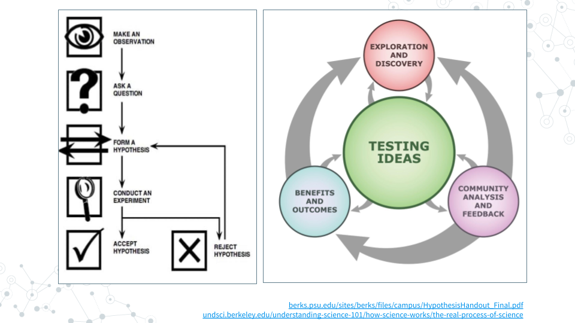
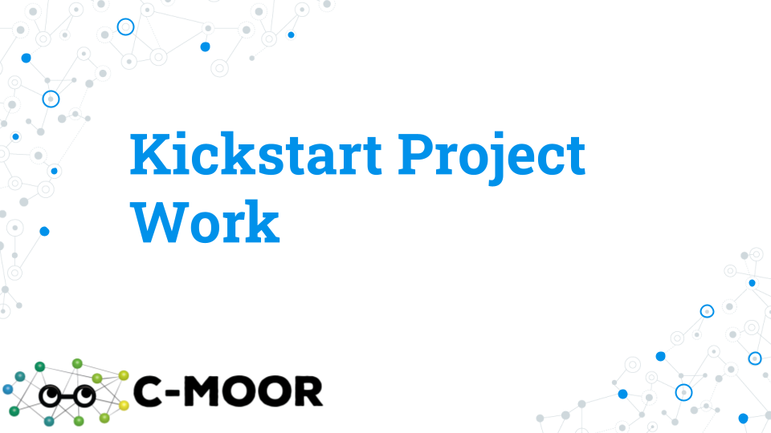

# (PART\*) Project Work {-}

<!-- Set up code -->

# Kickstart Project Work

<h2>Purpose</h2>

The purpose of **Project Work** is to gain practice in scientific exploration and research, communication, and work on your scientific poster! The purpose of **Kickstart Project Work** lab is to kick off project work with reviewing project work goals, setting up project work expectations, and modeling getting started with data import and analysis.

<h2>Learning Objectives</h2>

1. Capstone Project Overview - Testing Ideas
1. Practice drafting hypothesis
1. Obtain data and run analysis

## Lecture - Kickstart Project Work

[Slides: Possible Datasets](https://docs.google.com/presentation/d/1j1u4frdYt18nVmjMs6ZPRoP1KfXxognVUYG-2itH6kE/edit?usp=sharing)

## Activity - Kickstart Project Work

### Learning Objectives

1. Import an example SRA sequencing data file by accession id (e.g. SRR) 
2. Perform classification of nanopore-sequenced soil MAGs with GTDB-Tk
3. Import an SRA dataset you would like to analyze for your research project
4. Use a new Galaxy tool that we have not worked through in class

### Activity 1 - Import an SRA file into Galaxy

#### Instructions

1. Upload sequencing reads for accession id SRR29980924 in Galaxy using **Faster Download and Extract Reads in FASTQ** tool.
2. Make your Galaxy history sharable.

#### Questions

|1. Share your Galaxy history with SRR29980924fastq data you downloaded with Faster Download and Extract Reads in FASTQ tool.|
|:--------|
| Galaxy history Link: |
| |

|2. Find and record the following features of your downloaded dataset below.|
|:--------|
| File size: |
|File format:|
|Job Runtime (Wall Clock):|
|First line of the sequencing file:|
| |

|3. Inspect SRR29980924 entry in NCBI https://www.ncbi.nlm.nih.gov/sra. Obtain the following sequencing information.|
|:--------|
|Organism: |
|Instrument:|
|Strategy:|
|Run:|
| |

### Activity 2 – Taxonomically classify nanopore-soil-subset MAGs with GTDB-Tk in Galaxy

#### Instructions

Using **GTDB-Tk Classify genomes** tool, classify the nanopore-soil MAGs you obtained  from **MetaBAT2** binning of contigs during Project: Finding AMRs, Activity 4. Note, `MetaBAT2 bins are a collection`, so try using **Dataset collection** (instead of multiple individual files) as input. 

#### Questions

|1. Record summary of MAG classification of Bacteria below.|
|:--------|
||
| |

|2. Record summary of MAG classification of Archaea below.|
|:--------|
||
| |

|3. Share your Galaxy history to GTDBtk classification below.|
|:--------|
||
| |

### Activity 3 – Import an SRA dataset of interest for your research project

#### Instructions

Upload sequencing reads from a dataset of interest using the **Faster Download and Extract Reads in FASTQ** tool.  Refer back to the table in the **Activity Possible Datasets** for BioProjects with known long read metagenomics datasets.

#### Questions

|1. Record the following features of your downloaded dataset below.|
|:--------|
|Accession ID:  |
|File size: |
|Job Runtime (Wall Clock): |
| |

|2. Inspect your SRA entry in NCBI https://www.ncbi.nlm.nih.gov/sra. Obtain the following sequencing information.|
|:--------|
|Organism:   |
| Instrument:  |
|Strategy: |
| Run: |
| |

### Activity 4 – Use a new Galaxy tool that may be useful for your project

#### Instructions

Find one new Galaxy tool that you think may be useful for your research project.  A few possibilities to get you started include:

- Prokka [Galaxy tutorial](http://training.galaxyproject.org/training-material/topics/genome-annotation/tutorials/annotation-with-prokka/tutorial.html)
- Bakta [Galaxy Tutorial](https://training.galaxyproject.org/training-material/topics/genome-annotation/tutorials/bacterial-genome-annotation/tutorial.html)
- antiSMASH [Galaxy tutorial](http://training.galaxyproject.org/training-material/topics/genome-annotation/tutorials/secondary-metabolite-discovery/tutorial.html 
- CheckM2 [Galaxy tutorial](https://training.galaxyproject.org/training-material/topics/genome-annotation/tutorials/bacterial-genome-quality-control/tutorial.html)
- Tools mentioned in tutorials like [GTN: Bacterial Genome Annotation](https://training.galaxyproject.org/training-material/topics/genome-annotation/tutorials/bacterial-genome-annotation/tutorial.html)
- Tools used in workflows like [https://nf-co.re/mag](https://nf-co.re/mag) (not all tools will be available on Galaxy)

#### Questions

|1. Briefly describe the tool e.g. how it works, what it takes as input, and what it produces as output.|
|:--------|
||
| |

|2. Describe briefly any problems you had running the tool and troubleshooting steps you tried.|
|:--------|
||
| |

|3.  If you were able to get the tool to run, describe the results and whether they provide additional information for your project.|
|:--------|
||
| |

### Grading Criteria

- <mark style="background color: yellow">Download as Microsoft Word (.docx) and upload on Canvas</mark>.

### Footnotes

**Resources**

- Google Doc

**Contributions and Affiliations**

- Valeriya Gaysinskaya, Johns Hopkins University
- Frederick Tan, Johns Hopkins University

Last Revised: June, 2025

# Identifying Datasets

## Lecture - Possible Datasets

[Slides: Possible Datasets](https://docs.google.com/presentation/d/1VxwSmAY8BUs3EfVcxPm3I8kNYJWjVqoHJrGOX3X3sog/edit?usp=sharing)

## Activity - Possible Datasets

A few ideas to get you started with the Project Work can be found in the Possible Datasets Lecture and Activity below. Your project work will culminate in poster making, poster sharing, and poster presentation.  Each group will present their capstone project during an in-class poster presentation. 

### Activity

*Estimated time: 50 min*

#### Instructions

1. Skim three abstracts
1. Pick one and answer the following questions
    - Notice – What about this abstract most interests you?
    - Dataset – Summarize at a high level where the samples came from, how many there are, and what technology was used for sequencing.
    - Wonder – Two or three questions you would like to ask using this (and any other) datasets.
1. Post your answers by replying to the “Project Work: Possible Datasets” topic in the Discussion Forum

|Possible Datasets (Long-read PacBio)| | | |
|:--|:--|:--|:--|
|**Soil**| | | |
| |Antarctic        |PRJNA1126331 | [pubmed.gov/39300163](https://pubmed.gov/39300163) |
| |Biocrust         |PRJNA691698  | [pubmed.gov/34795375](https://pubmed.gov/34795375) | 
|**Water**| | | |
| |Fresh Water      |PRJNA924152  | [pubmed.gov/36823661](https://pubmed.gov/36823661) |
| |Ocean Water      |PRJNA853328  | [pubmed.gov/36448813](https://pubmed.gov/36448813) |
|**Human Gut**| | | |
| |Vegan/Omnivore   |PRJNA750084  | [pubmed.gov/36289209](https://pubmed.gov/36289209) |
| |Infant Nutrition |PRJNA1139951 | [pubmed.gov/31022095](https://pubmed.gov/31022095) |
|**and More!**| | | |
| |Lamb Gut         |PRJNA595610  | [pubmed.gov/34980911](https://pubmed.gov/34980911) |
| |Deadwood         |PRJNA603240  | [pubmed.gov/39627869](https://pubmed.gov/39627869) |
| |Cheese           |PRJNA778418  | [pubmed.gov/36622155](https://pubmed.gov/36622155) |
| |Whey             |PRJNA454439, PRJNA477604 | [pubmed.gov/31238873](https://pubmed.gov/31238873) |

### Grading Criteria

- Submit URL to your reply on Canvas

### Footnotes

**Resources**

- [Google Doc](https://docs.google.com/document/d/1WY16fnRl_ypFOdIi5BWOXmigeyKzguwy)

**Contributions and Affiliations**

- Valeriya Gaysinskaya, Johns Hopkins University
- Frederick Tan, Johns Hopkins University

Last Revised: May 2025

# Conducting Your Research

Conducting your research involves **prioritizing**, **scaffolding** and **organizing** your work as you progress towards a final poster presentation.  This chapter outlines how to approach your research in an organized and efficient manner, incorporating feedback and review from both, peers and instructors. 

Your research process will involve several recurrent activities during the **Project Work phase**, including:

- **Round Table Data and Troubleshooting** (in-class, community discussions)
- **Written Checkins** (Group-specific written updates for instructors and peers)
- **Advisory Meetings** (Scheduled group meetings with instructors)

## Project Work Organizer

Research lab meetings are valuable opportunities to receive community analysis and feedback.  Many class sessions should be spent discussing project progress, alternating between data results and troubleshooting methods.  

Use the **Project Work Organizer** to:

- Locate the appropriate slidedecks
- Track your document and milestones
- Receive instructor feedback and peer review

By following the Project Work Organizer, participating in Round Table sessions, submitting thorough Written Check-Ins, and engaging in Advisory Meetings, you will:

- Receive regular feedback from peers and instructors
- Stay organized and on schedule
- Develop your project into a polished final poster presentation

### Round Table Data & Troubleshooting 

Round table sessions are in-class "research lab meetings" where students share progress, receive feedback, and collaboratevely troubleshoot problems. 

**How it Works**

- The instructor will create **shared slidedecks for all groups**: 
  - **Round Table Data** slidedeck
  - **Round Table Troubleshooting** slidedeck
  - **Poster** slidedeck
  - **Final Presentation** slidececk
- Students will present and update their work using these slidedecks on designed class days.

**Sample Round Table Schedule**

|Course Week | Day 1 | Day 2 |
|:--|:--|:-- | 
|6| Round Table Data| Round Table Troubleshooting |
|7| Round Table Data| Guest Science Talks|
|8| Round Table Troubleshooting| Round Table Data | 
|9| Round Table Data | Round Table Troubleshooting|
|10|Round Table Data | Round Table Troubleshooting |
|11| Round Table Poster Review| Round Table Poster Review |
|12| Guest Science Talks| Round Table Poster Review|
|13| Final Poster Presentations | Wrap-up |

### Written Check-ins

Written check-ins are documents for group-instructor interaction, and they will also serve as the platform for peer reviews. 

**How it Works**

Each group will be assigned a Written **Check-in Document** which will include the following sections:

**a. Written Check-in (project overall)** 

Summarize the work you’ve done, receive feedback, respond to feedback, ask for help and guidance. 

- New progress since last submission (15 pts)
- How you’ve addressed prior feedback (15 pts)
- Poster organization (10 pts)
- Struggles and questions (10 pts)

**b. Written Check-in (Poster-specific)** 

Begin developing your poster using material from Round Table updates.  A poster template will be provided. Include:

- Title and authors (10 pts)
- Hypothesis and diagram or figure (10 pts)
- Dataset table with sample metadata including accession ID, collection method, etc. (10 pts)
- Methods (details and figure) (10 pts)
- Results (10 pts)

**c. Peer Review**

Each person will work individually to peer **review two other projects**. Provide written feedback **in group's check-in document**, including:

- Aspects of the project that you find fascinating
- Questions yabout the approach or results
- Suggestions for next steps, poster organization, etc.

### Advisory Meetings

**Advisory Meeting** 

Each group will schedule a meeting with the instructors to discuss progress.

- Meetings take place **outlide of class**
- Schedule using e.g. **When2Meet link** in the Group Information section
- Be sure to meet **before the assigned deadlines**

### Sample Project Work Document Organizer

Use this sample organizer to track your group's documents and meetings:

|Group | Check-in (Doc) | Poster (Slides) | Meeting #1 (Date)| Meeting # 2 (Date)|
|:--| :--| :-- | :-- | :-- | 
|Group A| Doc | Slides | Date 1 | Date 2| 
|Group B| Doc | Slides | Date 1 | Date 2| 
|Group C| Doc | Slides | Date 1 | Date 2| 
|Group D| Doc | Slides | Date 1 | Date 2| 

### Footnotes

**Contributions and Affiliations**

- Valeriya Gaysinskaya, Johns Hopkins University
- Frederick Tan, Johns Hopkins University

Last Revised: June 2025
